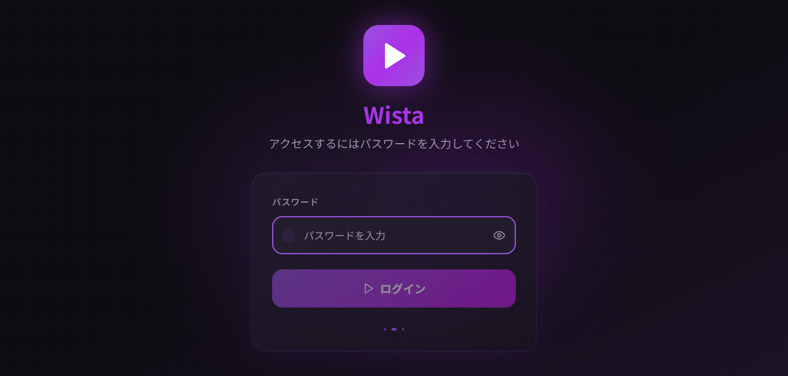
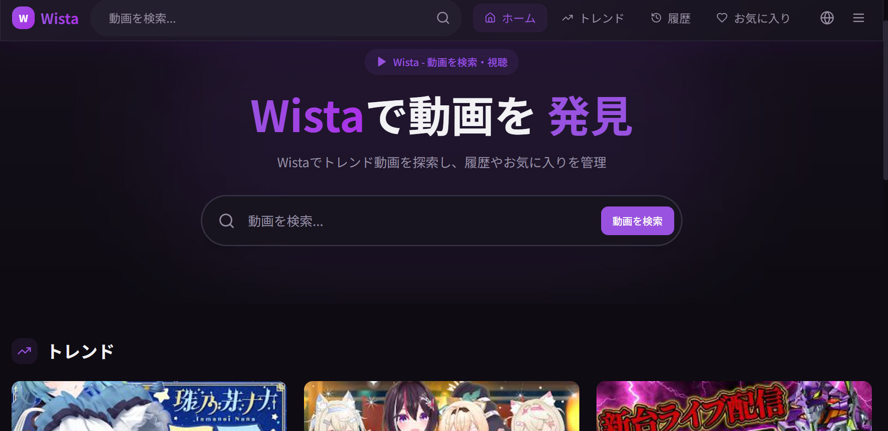
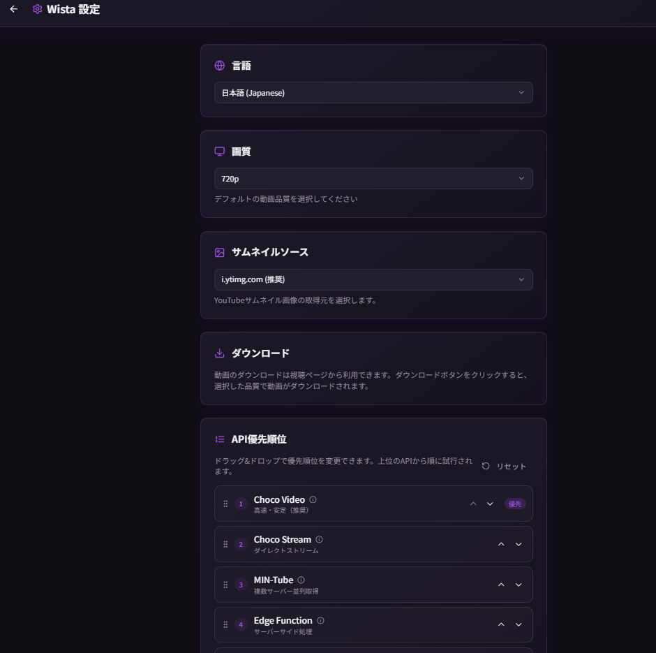
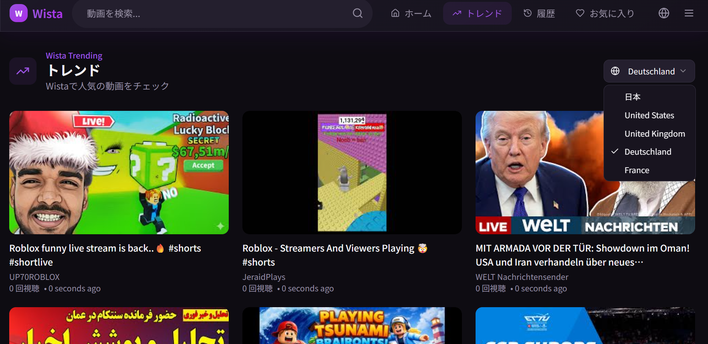

# WISTA

---

## 概要

**WISTA** は、  
多数の API と再生方式を組み合わせた  
**非商用・自由利用を前提とした Web 動画視聴アプリケーション**です。

> ⚠ 本プロジェクトは動画配信サービスの公式API・規約を尊重し、  
> 違法取得・著作権侵害を目的としたものではありません。

- ブロック環境でも再生可能  
- 音声のみ再生対応  
- 複数の再生方式を選択可能  
- 日本語・英語対応  
- 各国（米国・フランス・英国など）のトレンド取得  
- ダウンロード機能対応（対応ソースのみ）

> WISTA は Google / YouTube とは一切関係のない  
> 独立したオープンソースプロジェクトです。

---

## デモ・公式サイト

🌐 **Website**  
https://wista.f5.si

---

## ソースコード

WISTA のビルド済みフロントエンドコードはこちらで公開されています。

https://raw.githubusercontent.com/wista-wl-project/Wista/refs/heads/main/index-html.txt

※ 単一HTMLとして配布されているバージョンです

---

## スクリーンショット

| Login | Home |
|------|------|
|  |  |

| Settings | Trend |
|---------|-------|
|  |  |

---

## 特徴

- SPA（Single Page Application）  
- React + TypeScript + Vite 構成  
- クライアント主導の再生設計  
- 複数 API 連携による柔軟な取得方式  
- 非商用利用を前提とした設計思想  

---

## 技術構成

- React  
- TypeScript  
- Vite  
- SPA構成  
- APIフェイルオーバー設計  

---

## ライセンス

本プロジェクトは  
**Wista 非商用コピーレフト・事前通知義務ライセンス  
（Wista Non-Commercial Copyleft License with Prior Notice / WNCCL-PN v1.0）**  
のもとで公開されています。

### 主な条件

- ❌ **商用利用は禁止**  
- 🔁 **派生・改変・再配布は同一ライセンス必須**  
- 📢 **改変・Fork・再配布・公開デプロイは事前通知必須**

### Fork・公開について

WISTA の Fork・改変・再公開・デプロイを行う場合  
**必ず事前通知が必要です。**

### 通知先

- GitHub Issue  
- メール: **wista-project@outlook.jp**

詳細は [`LICENSE`](LICENSE) を必ずご確認ください。

---

## 商用利用を検討している方へ

WISTA は原則 **非商用利用のみ** 許可されています。

商用・業務利用・収益化を検討している場合は、  
必ず **事前に商用問い合わせ Issue** を作成してください。

👉 **商用問い合わせはこちら**  
https://wista.f5.si

（Issue テンプレートが自動的に適用されます）

---

## よくある質問・誤解対策

ライセンス・商用利用・Fork・デプロイ・合法性など、  
**誤解されやすい点は FAQ にまとめています。**

👉 [`FAQ.md`](FAQ.md)

**自己判断する前に必ずご確認ください。**

---

## コントリビューション

Issue・Pull Request・翻訳・改善提案など、  
あらゆる貢献を歓迎します。

ただし、

- 非商用方針  
- ライセンス条件  
- 行動規範  

を必ず守ってください。

👉 [`CONTRIBUTING.md`](CONTRIBUTING.md)

---

## 行動規範

WISTA コミュニティでは、  
誠実で建設的なコミュニケーションを重視しています。

👉 [`CODE_OF_CONDUCT.md`](CODE_OF_CONDUCT.md)

---

## セキュリティについて

脆弱性を発見した場合は、  
**公開 Issue を作成せず、非公開で報告**してください。

👉 [`SECURITY.md`](SECURITY.md)

---

## リリース・バージョン方針

WISTA のバージョン管理・破壊的変更の扱いについては  
以下をご確認ください。

👉 [`RELEASE.md`](RELEASE.md)

---

## ガバナンス・運営方針

本プロジェクトの  
意思決定・権限・責任範囲について明確に定義しています。

👉 [`GOVERNANCE.md`](GOVERNANCE.md)

---

## 注意事項

- 違法アップロードを推奨しません  
- 著作権侵害を助長しません  
- 利用は自己責任で行ってください  
- 各国の法令・規約を遵守してください  

---

## 最後に

WISTA は、  
**自由で非商用な動画視聴環境を守るためのプロジェクト**です。

ルールは制限ではなく、  
プロジェクトと利用者を守るためのものです。

ご理解・ご協力をお願いします。
